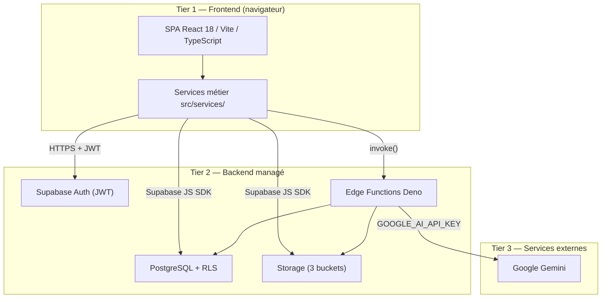
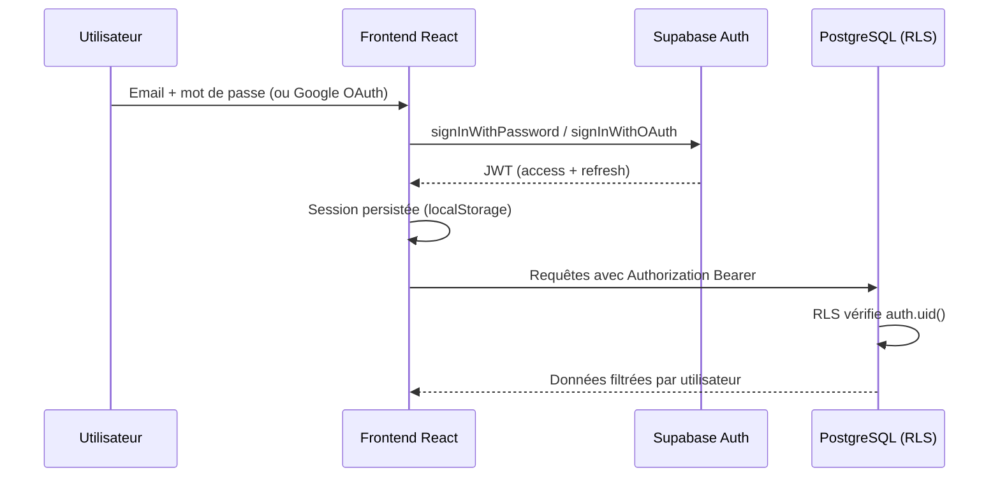
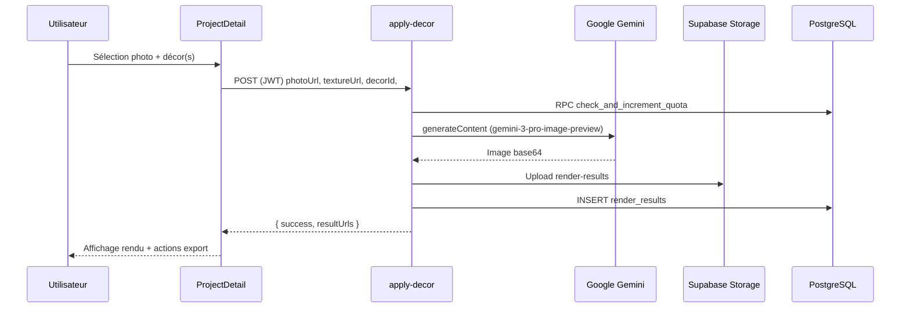

# Architecture — DICA Decorator

> Document de référence technique (vue d'ensemble). Pour l'audit détaillé et la
> valorisation, voir
> [`audit/PROJECT_DOCUMENTATION_STANDARD.md`](./audit/PROJECT_DOCUMENTATION_STANDARD.md).
> Pour l'orchestrateur IA, voir
> [`DICA_ORCHESTRATOR_GUIDE.md`](./DICA_ORCHESTRATOR_GUIDE.md).

| Champ | Valeur |
|---|---|
| Projet | `dica-decorator` v2.2.0 |
| Éditeur | KOREV AI |
| Client | DICA France |
| Dernière revue | 2026-06-13 |

---

## Table des matières

1. [Vue d'ensemble](#1-vue-densemble)
2. [Stack technique](#2-stack-technique)
3. [Structure du dépôt](#3-structure-du-dépôt)
4. [Flux d'authentification](#4-flux-dauthentification)
5. [Flux de génération IA](#5-flux-de-génération-ia)
6. [Backend Supabase](#6-backend-supabase)
7. [Sécurité](#7-sécurité)
8. [CI/CD et déploiement](#8-cicd-et-déploiement)
9. [Documents connexes](#9-documents-connexes)

---

## 1. Vue d'ensemble

DICA Decorator est une **SPA React** adossée à un **backend managé Supabase**
(PostgreSQL, Auth, Storage, Edge Functions Deno). La génération d'images et le
chat IA passent par **Google Gemini**, appelé exclusivement depuis les Edge
Functions — aucune clé API n'est exposée au navigateur.



### Routes applicatives

Les pages sont déclarées dans `src/App.tsx` :

| Route | Page | Protection |
|---|---|---|
| `/` | Accueil (vidéo + entrée) | Publique |
| `/auth` | Connexion / inscription | Publique |
| `/dashboard` | Tableau de bord projets | Authentifié |
| `/project/new` | Création de projet | Authentifié |
| `/project/:id` | Détail projet (photos, rendus) | Authentifié |
| `/creative` | Assistant créatif IA | Authentifié |
| `/favorites` | Favoris (rendus + créations) | Authentifié |
| `/ai-creations` | Galerie créations IA | Authentifié |
| `/mon-cobranding` | Paramètres cobranding revendeur | Authentifié |
| `/presentation/:projectId` | Mode présentation plein écran | Authentifié |
| `/help` | Aide | Authentifié |
| `/admin` | Administration | Admin |
| `/admin/analytics` | Analytics | Admin |
| `/mentions-legales` | Mentions légales | Publique |

---

## 2. Stack technique

| Couche | Technologies | Source |
|---|---|---|
| UI | React 18, TypeScript 5, TailwindCSS 3, shadc… | `package.json` |
| Build | Vite 5, port dev 8080 | `vite.config.ts` |
| Routing | React Router DOM v6 | `src/App.tsx` |
| État serveur | TanStack Query v5 (staleTime 5 min) | `src/App.tsx` |
| Formulaires | react-hook-form + zod | `package.json` |
| Auth client | @supabase/supabase-js (JWT, l… | `src/integrations/supabas… |
| PDF client | jsPDF (brochures, magazine… | `src/services/*-pdf.service.ts` |
| Backend | Supabase (Auth, Postgres, Storage, Edge Fun… | `supabase/` |
| IA image | Gemini `gemini-3-pro-im… | `supabase/functions/apply-decor/` |
| IA texte | Gemini `gemini-2.5-flash`… | `supabase/functions/creative-chat/` |
| Tests unitaires | Vitest + Testing Library… | `package.json`, `src/**… |
| Tests E2E | Playwright | `e2e/`, `.github/workflows/e2e.yml` |

---

## 3. Structure du dépôt

```text
dica-decorator/
├── src/
│   ├── pages/           # Écrans (lazy-loaded)
│   ├── components/      # UI + composants métier (admin/, analytics/)
│   ├── services/        # Logique métier TypeScript (21 services)
│   ├── hooks/           # Hooks React (projets, décors, catalogues)
│   ├── contexts/        # AuthContext, ThemeContext
│   ├── integrations/    # Client Supabase, types générés
│   └── lib/             # Utilitaires (compression image, signed URLs)
├── supabase/
│   ├── migrations/      # Schéma PostgreSQL versionné
│   └── functions/       # Edge Functions Deno (5 fonctions actives)
├── e2e/                 # Specs Playwright
├── docs/                # Documentation
└── .github/workflows/   # CI, CD Edge, E2E
```

### Services métier principaux (`src/services/`)

| Service | Rôle |
|---|---|
| `gemini-image.service.ts` | Appel Edge Function `apply-decor`, help |
| `quota.service.ts` / `rate-limiter.service.ts` | Quotas organisation / |
| `organization.service.ts` | Multi-tenant (organisations, membres) |
| `share-link.service.ts` | Partage sécurisé par lien à expiration |
| `image-export.service.ts` | Export PNG / JPEG / WebP |
| `reseller-brochure-pdf.service.ts` | Brochure revendeur cobrandée |
| `magazine-deco-pdf.service.ts` | Magazine DÉCO éditorial |
| `url-validator.service.ts` | Garde anti-SSRF côté frontend |
| `auth-guard.service.ts` | Vérification rôles et ownership |

---

## 4. Flux d'authentification



### Mécanismes observés

- **Inscription / connexion** : `src/pages/Auth.tsx` — onglets Connexion et
Inscription, validation zod du mot de passe (8 car., majuscule, minuscule,
chiffre, caractère spécial).
- **OAuth Google** : boutons « Continuer avec Google » / « S'inscrire avec
Google ».
- **Récupération mot de passe** : `resetPasswordForEmail` avec redirection vers
`/auth` ; formulaire de nouveau mot de passe intercepté via événement
`PASSWORD_RECOVERY` dans `AuthContext`.
- **Rôles** : enum SQL `app_role` (`admin` | `client`), table `user_roles`.
Récupération côté client dans `AuthContext`, garde de route dans
`ProtectedRoute` (`requireAdmin` pour `/admin` et `/admin/analytics`).
- **Vérification serveur** : Edge Functions sensibles vérifient le JWT puis
consultent `user_roles` avec la clé `service_role`.

---

## 5. Flux de génération IA

### 5.1 Application de décor sur photo (parcours projet)



**Limites côté Edge Function** (`apply-decor`) :

- Taille image max : 12 Mo
- Rendus max par requête : 2
- Timeout fetch : 30 s
- Mode multi-décor supporté pour le cas d'usage `ascenseur` (parois + sol)

### 5.2 Assistant créatif (chat + image)

1. L'utilisateur envoie un message depuis `/creative`.
2. Edge Function `creative-chat` :
   - Charge le catalogue structuré (catalogs → decors) pour le contexte RAG.
   - Appelle l'orchestrateur (`orchestrator.ts`) pour valider/structurer la
demande.
   - Stream texte via `gemini-2.5-flash` (SSE, format compatible OpenAI).
   - Génère une image si demandé via `gemini-3-pro-image-preview`.
3. Validation post-stream : détection des références inventées hors catalogue.

Voir [`DICA_ORCHESTRATOR_GUIDE.md`](./DICA_ORCHESTRATOR_GUIDE.md) pour le détail
de l'orchestrateur.

### 5.3 Légendes Magazine DÉCO

Edge Function `generate-magazine-captions` : génère headline, subheadline,
slugline, caption et article à partir du contexte projet et d'une image
optionnelle. Consommée par `magazine-deco-pdf.service.ts` côté client.

---

## 6. Backend Supabase

### Base de données

- **Migrations** : `supabase/migrations/` (schéma versionné, RLS activée sur les
tables métier).
- **Tables principales** : `projects`, `project_photos`, `render_results`,
`decors`, `decor_categories`, `catalogs`, `catalog_decor_links`, `profiles`,
`user_roles`, `user_quotas`, `organizations`, `organization_members`,
`share_links`, `render_favorites`, `creative_favorites`.
- **Fonctions SQL** : `has_role()`, `check_and_increment_quota`, triggers
`updated_at`, trigger `on_auth_user_created`.

### Storage

Trois buckets identifiés dans `src/services/image-storage.service.ts` :

| Bucket | Usage |
|---|---|
| `project-photos` | Photos originales uploadées |
| `render-results` | Rendus générés |
| `decor-textures` | Textures du catalogue |

Les buckets privés sont servis via URLs signées (`src/lib/signed-storage.ts`).

### Edge Functions actives

| Fonction | Rôle |
|---|---|
| `apply-decor` | Génération de rendus décor sur photo |
| `creative-chat` | Chat IA + génération image créative |
| `generate-magazine-captions` | Textes éditoriaux Magazine DÉCO |
| `get-analytics` | Métriques agrégées (admin) |
| `get-users-admin` | Gestion utilisateurs (admin) |

Catalogue détaillé : [`API_EDGE_FUNCTIONS.md`](./API_EDGE_FUNCTIONS.md).

---

## 7. Sécurité

### Row Level Security (RLS)

Pattern récurrent : `auth.uid() = user_id` pour les ressources utilisateur ;
`has_role(auth.uid(), 'admin')` pour l'administration. Les policies sont
définies dans les migrations SQL.

### Protection SSRF

| Couche | Module | Stratégie |
|---|---|---|
| Frontend | `src/services/url-validator… | Validation des URLs avant fetch… |
| Edge Functions | `_shared/ssrf-guard.ts` | Whitelist hosts, blocage RFC19… |

### Quotas et rate limiting

- **Quota rendus** : RPC `check_and_increment_quota` appelée atomiquement dans
`apply-decor` avant l'appel Gemini.
- **Quotas organisation** : `quota.service.ts` — tiers `starter` / `pro` /
`enterprise`, reset mensuel UTC.
- **Rate limit journalier** : `rate-limiter.service.ts` — reset minuit UTC.

### Secrets

- Frontend : uniquement `VITE_SUPABASE_*` (clé anon, protégée par RLS).
- Edge Functions : `GOOGLE_AI_API_KEY`, `SUPABASE_SERVICE_ROLE_KEY`,
`AI_GATEWAY_API_KEY`, `AI_GATEWAY_URL` — provisionnés via `supabase secrets
set`, jamais commités.
- Template : `.env.example`.

---

## 8. CI/CD et déploiement

| Pipeline | Fichier | Déclenchement |
|---|---|---|
| CI qualité | `.github/workflows/ci.yml` | PR + push `main`/`develop` |
| Quality gate | `.github/workflows/quality-gate.yml` | Complément CI |
| E2E Playwright | `.github/workflows/e2e.yml` | PR + push branches… |
| CD Edge Functions | `.github/workflows/cd-edge-fu… | **Manuel** (`workflo… |

Le frontend (`npm run build` → `dist/`) n'a **pas** de déploiement automatique
dans le repo ; l'hébergement statique est géré séparément. Voir
[`DEPLOIEMENT.md`](./DEPLOIEMENT.md).

---

## 9. Documents connexes

| Document | Contenu |
|---|---|
| [`audit/PROJECT_DOCUMENTATION_… | Référence audit cabinet (architecture… |
| [`HANDOVER_DEVELOPPEUR.md`](./H… | Handover technique (alertes, credential… |
| [`GUIDE_DEVELOPPEUR.md`](./GUIDE_DEV… | Setup local, conventions, tests |
| [`API_EDGE_FUNCTIONS.md`](./API_EDGE_F… | Catalogue des Edge Functions |
| [`DEPLOIEMENT.md`](./DEPLOIEMENT.md) | Procédures de déploiement |
| [`adr/0001-exclusion-shadcn-ui-de-l-a… | ADR exclusion shadcn/ui de l… |

---

© DICA France — base logicielle développée par KOREV AI.
